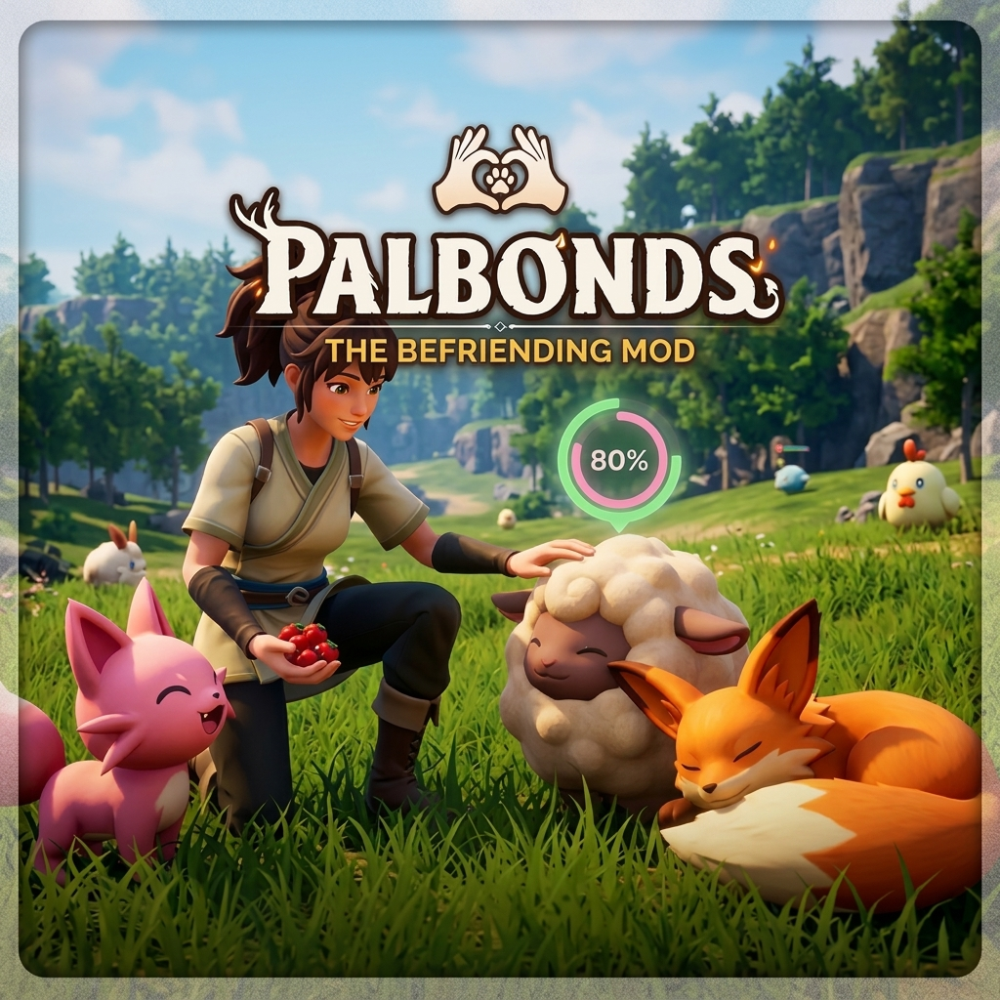

# PalBonds

A Palworld mod: earn a wild Pal's trust instead of throwing a sphere at it.

Pet it, feed it, play with it. Every wild Pal has its own personality, shown
in a tag over its head, and reacts to you differently. Warm one up enough and
it starts following you, fights at your side, and eventually joins your party
on its own — no sphere, no fight. Mistreat it, or leave it behind, and it's
gone for good.

Nothing new is authored: no models, textures, or animations. Everything reuses
behavior the game already has.



## Built with AI assistance

The design, the Lua code, and most of the documentation in this repo —
including the reverse-engineering notes in
[`docs/hook-points.md`](./docs/hook-points.md) — were built with AI
assistance. If that's something you'd rather not run on your
machine, that's entirely your call — this section exists so you can make it
before installing, not after.

## Features

- **Pet, Feed, and Play** on wild Pals through the game's own radial menu (and
  F8 for Play), the same interactions you already use on your own Pals.
- **Seven personalities** — Normal, Curious, Timid, Aloof, Grumpy, Hostile,
  Feral — rolled per individual, shown as a tag under the Pal's health bar
  alongside a trust meter.
- **Following and combat assist.** A bonded Pal stays behind you, holds still
  when you're aiming at it, joins your fights, and defends itself if
  something goes after it while you're busy elsewhere.
- **Feed scales with rarity.** Better food earns more trust. Kinship Peaches,
  found rather than crafted, are worth the most.
- **Level and rank aware.** The trust bar scales with the level gap between
  you and the Pal; alphas need twice the usual trust before they'll join.
- **Consequences.** Hit a bonded Pal and it's over between you. Wander too far
  and leave one behind, and it gives up on you too.
- **Sphere-less joining** — a real celebration, a join effect, and a
  friendship head start for the Pal that just chose you.

## Get it

- **Steam Workshop:** [PalBonds - The Befriending Mod](https://steamcommunity.com/sharedfiles/filedetails/?id=3797816321)
  — installs its own UE4SS dependency for you.
- **Nexus Mods / manual install:** grab the latest `PalBonds-vX.Y.Z.zip` under
  [`release/`](./release), or build it yourself from [`mod/PalBonds/`](./mod/PalBonds).

## Requirements

- **Palworld**
- **UE4SS** (the experimental Palworld build) — installed automatically if you
  use the Steam Workshop version; otherwise grab it from
  [Nexus Mods](https://www.nexusmods.com/palworld/mods/2237) or the
  [Palworld Modding Docs](https://pwmodding.wiki/docs/category/ue4ss) first.

Use only **one** UE4SS install (manual or Workshop) at a time — running both
together crashes the game.

## Manual install

Drop the whole `PalBonds` folder into your UE4SS `Mods/` directory:

```
Pal/Binaries/Win64/ue4ss/Mods/PalBonds/        <- manual UE4SS install
Mods/NativeMods/UE4SS/Mods/PalBonds/           <- Steam Workshop UE4SS install
```

```
PalBonds/
├── enabled.txt
└── Scripts/
    └── main.lua (+ the rest)
```

Launch the game — UE4SS's console should print a line confirming PalBonds
loaded.

## Controls

| Key | Action |
|---|---|
| `4` | Radial menu — Pet and Feed a wild Pal you're looking at |
| `F8` | Play with the wild Pal you're looking at |
| `F9` | Show / hide personality tags |
| `F10` | Pause / resume passive friendship gain for followers |

Get close and look directly at the Pal for any of these.

## Known issues

- **A bonded wild Pal (50%+ friendship bar) may despawn if it moves too far
  from its spawn location.** This is Palworld's own wild-Pal lifecycle: the
  game unloads the spawn area you left and clears the Pals that belonged to
  it, and a bonded Pal is still a wild Pal until you catch her. It is not
  something a mod can currently veto — UE4SS's Lua `RegisterHook` has no
  cancel, so the despawn call can be observed but not blocked. If you want to
  keep a companion permanently, complete the bond; otherwise bonding again in
  a new area costs nothing but food. The full investigation, including the
  approaches that did *not* work, is in [`CLAUDE.md`](./CLAUDE.md).
- **Microstutter reports, under investigation.** At least one player reports
  noticeable microstutters with the mod active. Not yet reproduced or
  confirmed to be the mod's doing. If you see it, a comment on either store
  page with your specs helps.

## Scope

Singleplayer and self-hosted worlds only. Mods are not permitted on official
Pocketpair servers, and using one there risks a ban.

## For developers

This repo is also a record of getting a UE4SS Lua mod to do things Palworld
was never built to expose — real AI disposition swaps, a working follow
action, sphere-less capture, combat assist through the Hate system, and more.
If you're building your own Palworld mod, [`docs/hook-points.md`](./docs/hook-points.md)
is a pass-by-pass log of what was tried, what worked, what didn't, and the
exact class and function names involved. [`DESIGN.md`](./DESIGN.md) has the
original subsystem breakdown; [`CLAUDE.md`](./CLAUDE.md) tracks current state,
known issues, and what's next.

`tools/harness/` is an offline test harness (fengari, a Lua VM in JS) that
runs the mod's real source against stubbed UE4SS globals — useful for
catching load-time and logic bugs without a full game launch.

## License

MIT — see [`LICENSE`](./LICENSE). Fork it, learn from it, build on it.

Unofficial fan mod. Palworld belongs to Pocketpair, Inc.
